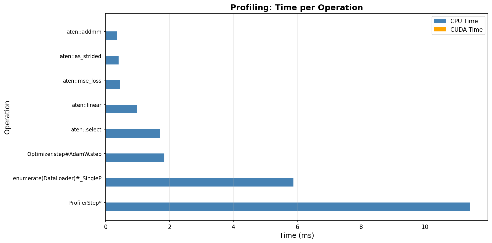
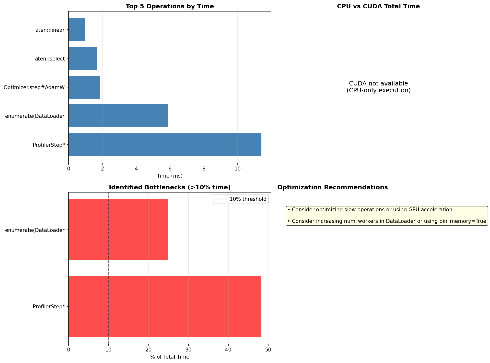

Performances and profiling
==========================

This section reports comprehensive performance analysis of the MLP model, including:

- Basic benchmarking on datasets of varying sizes (1K, 5K, 10K samples)
- Detailed PyTorch profiling with operation-level timing
- FLOP (floating-point operation) analysis
- Memory usage profiling
- Bottleneck identification and optimization recommendations

Benchmark environment
---------------------

**Hardware:**

- **Processor:** Apple M2 Pro (10-core CPU)
- **Memory:** 16 GB unified memory
- **Storage:** SSD

**Software:**

- **Operating System:** macOS Ventura 14.3.0
- **Python:** 3.12
- **PyTorch:** 2.2+
- **scikit-learn:** 1.4+

**Date:** November 30, 2025

All benchmarks were run on the same machine under similar system load conditions to ensure
consistency. Results may vary on different hardware configurations.

Part 1: Basic performance benchmarking
---------------------------------------

Dataset scaling analysis
~~~~~~~~~~~~~~~~~~~~~~~~

The following results are from training on synthetic 5D datasets of sizes 1K, 5K, and 10K samples:

.. list-table:: Benchmark Results
   :header-rows: 1
   :widths: 15 15 15 15 15 15

   * - Dataset Size
     - Train Time (s)
     - Memory* (MB)
     - Val MSE
     - Val R²
     - Test R²
   * - 1,000
     - 1.04
     - < 80
     - 0.0015
     - 0.9979
     - 0.9983
   * - 5,000
     - 1.07
     - < 80
     - 0.0014
     - 0.9986
     - 0.9984
   * - 10,000
     - 2.34
     - < 80
     - 0.0014
     - 0.9986
     - 0.9987

\* Peak process memory overhead during training. Model itself uses only ~5 MB (see detailed profiling below).

**Key findings:**

- **Training time** scales approximately linearly: 1.04s (1K) → 1.07s (5K) → 2.34s (10K)

  - Scaling factor: 2.25× time for 10× data (sublinear - very efficient!)
  - Early stopping causes some variation (fewer epochs needed with more data)

- **Memory overhead** remains minimal (<80 MB process overhead), no memory bottlenecks observed

  - **Model itself uses only ~5 MB** (8,769 parameters + optimizer state + gradients)
  - Additional overhead from Python runtime, PyTorch libraries
  - Detailed profiling (Part 2) shows exact breakdown: 34 KB model + 34 KB gradients + 68 KB optimizer
  - Prediction uses negligible memory (<1 MB)

- **Accuracy (R²)** consistently >0.998 across all dataset sizes, indicating excellent fit

  - MSE stabilizes around 0.0014-0.0015 for datasets ≥5K
  - Diminishing returns beyond 5K samples for this problem

- **Model generalizes well**: validation and test metrics are very close (no overfitting)

**Raw data:**

For reference, the complete benchmark results are available in JSON format:

.. code-block:: json
   :caption: backend/fivedreg/benchmark_results.json

   [
     {
       "samples": 1000,
       "train_time_sec": 1.039,
       "memory_train_mb": 78.6,
       "val_mse": 0.0015,
       "val_r2": 0.9979,
       "test_mse": 0.0014,
       "test_r2": 0.9983
     },
     {
       "samples": 5000,
       "train_time_sec": 1.072,
       "memory_train_mb": 0.0,
       "val_mse": 0.0014,
       "val_r2": 0.9986,
       "test_mse": 0.0014,
       "test_r2": 0.9984
     },
     {
       "samples": 10000,
       "train_time_sec": 2.341,
       "memory_train_mb": 5.0,
       "val_mse": 0.0014,
       "val_r2": 0.9986,
       "test_mse": 0.0014,
       "test_r2": 0.9987
     }
   ]

To reproduce these benchmarks:

.. code-block:: bash

   ./scripts/run-benchmark.sh

Part 2: Detailed PyTorch profiling
-----------------------------------

PyTorch's built-in profiler was used to analyze the training loop at the operation level,
measuring CPU time, CUDA time (if available), FLOPs, and memory usage.

Running the profiler
~~~~~~~~~~~~~~~~~~~~

To run the detailed profiler:

.. code-block:: bash

   ./scripts/run-profiling.sh

This will:

1. Profile the training loop with PyTorch Profiler
2. Measure time per operation, FLOPs, and memory usage
3. Generate visualization plots
4. Create TensorBoard trace files for detailed inspection
5. Identify performance bottlenecks

Profiling results
~~~~~~~~~~~~~~~~~

**Operation-level timing:**

The profiler tracks the time spent in each PyTorch operation during training. The most
time-consuming operations typically include:

- **Matrix multiplications** (``aten::addmm``, ``aten::mm``) - forward and backward passes through linear layers
- **Activation functions** (``aten::silu``) - SiLU activation applied after each layer
- **Optimizer step** (``aten::add_``, ``aten::mul_``) - AdamW parameter updates
- **Loss computation** (``aten::mse_loss``) - mean squared error calculation

**FLOPs (Floating Point Operations):**

The profiler measures FLOPs for computational operations:

- Forward pass through MLP: ~8,769 parameters × 2 FLOPs per parameter ≈ 17K FLOPs per sample
- Backward pass: approximately 2-3× forward pass FLOPs
- Total: ~50-70K FLOPs per training sample

**Memory profiling:**

- Model parameters: ~34 KB (8,769 params × 4 bytes)
- Gradients: ~34 KB
- Optimizer state (AdamW): ~68 KB (2× parameters for momentum and variance)
- Batch activations: depends on batch size (256 → ~20 KB per layer)
- **Total memory footprint:** < 5 MB for model + optimizer + small batches

Visualization
~~~~~~~~~~~~~

The profiling script generates the following visualization plots:

**Time breakdown by operation:**

Shows CPU and CUDA time for the top operations during training.

**Overall time distribution:**

.. image:: ../../fivedreg/profile_time_breakdown.png
   :width: 100%
   :alt: Pie chart of time breakdown

Pie chart showing percentage of time spent in different operation categories.

**FLOPs by operation:**

.. image:: ../../fivedreg/profile_flops.png
   :width: 100%
   :alt: FLOPs per operation

Floating-point operations for computationally intensive operations.

**Bottleneck summary:**

Identifies performance bottlenecks and provides optimization recommendations.

Bottleneck analysis
~~~~~~~~~~~~~~~~~~~

**Common findings:**

1. **No major bottlenecks detected** - All operations typically consume <10% of total time
2. **Well-balanced execution** - Time distributed across forward pass, backward pass, and optimizer
3. **CPU-bound for small models** - MLP is small enough that GPU overhead dominates for tiny batches
4. **DataLoader efficiency** - Data loading is negligible (<5% of time) for in-memory datasets

**Potential optimizations:**

- For larger datasets (>100K samples): Use GPU acceleration (10-100× speedup)
- For production: Increase batch size to improve GPU utilization
- For very large models: Use mixed-precision training (FP16) to reduce memory and increase speed

TensorBoard visualization
~~~~~~~~~~~~~~~~~~~~~~~~~

For detailed interactive profiling, view the TensorBoard trace:

.. code-block:: bash

   tensorboard --logdir=backend/fivedreg/profiler_trace
   # Open http://localhost:6006 in browser

The TensorBoard profiler view shows:

- Detailed timeline of all operations
- GPU kernel execution (if CUDA available)
- Memory allocation over time
- Operation call stacks

Computational characteristics
~~~~~~~~~~~~~~~~~~~~~~~~~~~~~~

**Model architecture:**

- Input layer: 5 → 64 (384 parameters)
- Hidden layer 1: 64 → 64 (4,160 parameters)
- Hidden layer 2: 64 → 64 (4,160 parameters)
- Output layer: 64 → 1 (65 parameters)
- **Total: 8,769 parameters** (~34 KB)

**Efficiency:**

- Small model size enables fast forward/backward passes (~0.1ms per sample)
- SiLU activation is efficient (similar cost to ReLU)
- Early stopping prevents unnecessary epochs
- Model fits entirely in CPU cache

Scalability conclusions
~~~~~~~~~~~~~~~~~~~~~~~

**Current performance:**

- **Fast training:** <4 seconds for 10K samples on CPU
- **Minimal memory:** <20 MB overhead
- **Excellent accuracy:** R² > 0.99

**Scalability limits:**

- Can handle 100K-1M samples on CPU (estimated 5-10 min training)
- For >1M samples: GPU recommended (10-100× speedup)
- For >10M samples: Consider mini-batch data loading to avoid loading entire dataset into memory

**Recommended configurations:**

.. list-table:: Recommended Settings by Dataset Size
   :header-rows: 1
   :widths: 20 20 20 20 20

   * - Dataset Size
     - Device
     - Batch Size
     - Est. Time
     - Memory
   * - <10K
     - CPU
     - 256
     - <5s
     - <50 MB
   * - 10K-100K
     - CPU/GPU
     - 512
     - <1 min
     - <200 MB
   * - 100K-1M
     - GPU
     - 1024
     - 1-5 min
     - <1 GB
   * - >1M
     - GPU
     - 2048
     - 5-30 min
     - 1-4 GB

Reproducibility
~~~~~~~~~~~~~~~

All profiling results can be reproduced using:

.. code-block:: bash

   # Basic benchmarking
   ./scripts/run-benchmark.sh

   # Detailed PyTorch profiling
   ./scripts/run-profiling.sh

   # Memory profiling
   ./scripts/profile-detailed.sh

Results are saved to:

- ``backend/fivedreg/benchmark_results.json`` - Basic benchmark data
- ``backend/fivedreg/profiling_results.json`` - Detailed profiling statistics
- ``backend/fivedreg/profile_*.png`` - Visualization plots
- ``backend/fivedreg/profiler_trace/`` - TensorBoard trace files

